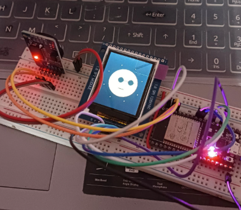
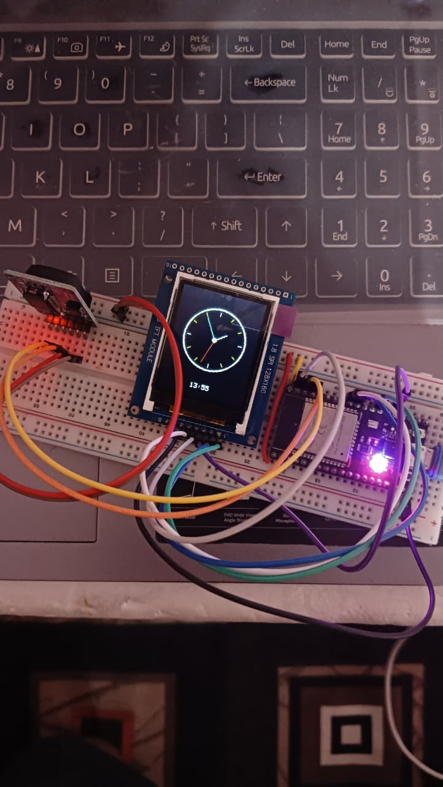

<<<<<<< HEAD
<<<<<<< HEAD
#  ESP32 TFT Real-Time Clock

This project is a **custom-made animated desk clock** built using an **ESP32 NodeMCU-32S**, **1.8-inch ST7735 TFT display**, and an **RTC module**.  
It features **smooth animations**, **multiple clock faces**, and a **fun, interactive design** that makes telling time more exciting.

---

## Project Images

### Clock Faces & Animations

### Hardware Setup

---

## Features
✅ Real-time clock display using an RTC module  
✅ Animated transitions between different clock faces  
✅ Runs entirely on ESP32 NodeMCU-32S (USB powered)  
✅ Colorful, high-contrast TFT graphics  
✅ Simple and compact breadboard build  

---

##  Hardware Required
- **ESP32 NodeMCU-32S**
- **1.8-inch ST7735 TFT Display**
- **DS3231 / DS1307 RTC Module**
- **Jumper Wires**
- **Breadboard** (optional for prototyping)

---

##  Wiring Diagram

**TFT Display to ESP32**
| TFT Pin | ESP32 Pin |
|---------|-----------|
| VCC     | 3.3V      |
| GND     | GND       |
| CS      | GPIO 5    |
| RST     | GPIO 4    |
| DC      | GPIO 2    |
| SCLK    | GPIO 18   |
| MOSI    | GPIO 23   |

**RTC Module to ESP32**
| RTC Pin | ESP32 Pin |
|---------|-----------|
| VCC     | 3.3V      |
| GND     | GND       |
| SDA     | GPIO 21   |
| SCL     | GPIO 22   |

---

##  How It Works
1. **RTC Module** keeps accurate time even when the ESP32 is powered off.  
2. **ESP32** reads the time and sends it to the **TFT display**.  
3. Clock **faces change with animations** to make the display interactive.  
4. Device runs fully **USB powered**, making it portable.

---

##  Getting Started
1. Install **Arduino IDE** and add **ESP32 board support**.
2. Install these libraries:
=======
=======
>>>>>>> 43822bfa49c21441759bb67f80e563e9e6ed706b
# ⏰ ESP32 TFT Real-Time Clock

This project is a custom-made digital clock built with ESP32 NodeMCU-32S, a 1.8-inch ST7735 TFT display, and a Real-Time Clock (RTC) module.  
It features smooth animations and multiple clock faces that change over time — making it not just functional, but fun to watch.

---

## 📸 Project Images

### Clock in Action

### Hardware Setup

---

## 📌 Features
✅ Real-time clock display using an RTC module  
✅ Animated transitions between different clock faces  
✅ Runs entirely on ESP32 NodeMCU-32S (USB powered)  
✅ Bright and colorful display with ST7735 TFT  

---

## 🛠 Hardware Required
- ESP32 NodeMCU-32S
- 1.8-inch ST7735 TFT Display
- DS3231 or DS1307 RTC Module
- Jumper wires
- Breadboard (optional)

---

## 🔌 Wiring Diagram

 TFT Pin   ESP32 Pin 
---------------------
 VCC       3.3V      
 GND       GND       
 CS        GPIO 5    
 RST       GPIO 4    
 DC        GPIO 2    
 SCLK      GPIO 18   
 MOSI      GPIO 23   

RTC Module Connection
 RTC Pin   ESP32 Pin 
---------------------
 VCC       3.3V      
 GND       GND       
 SDA       GPIO 21   
 SCL       GPIO 22   

---

## 📷 How It Works
1. The RTC module keeps track of accurate time even when the ESP32 is off.
2. The TFT display shows the current time in different designs, changing automatically.
3. The ESP32 updates the display every second with smooth animations.

---

## 🚀 Getting Started
1. Install Arduino IDE and add ESP32 board support.
2. Install the following libraries
<<<<<<< HEAD
>>>>>>> 48aa02d (Added ESP32 project files)
=======
>>>>>>> 43822bfa49c21441759bb67f80e563e9e6ed706b
   - `WiFi.h`
   - `WebServer.h`
   - `Adafruit_GFX.h`
   - `Adafruit_ST7735.h`
   - `RTClib.h`
<<<<<<< HEAD
<<<<<<< HEAD
3. Connect components according to the wiring table above.
4. Upload the `.ino` file to your ESP32.
5. Enjoy your custom **animated real-time clock**.
=======
3. Connect the components according to the wiring table above.
4. Upload the `.ino` file to your ESP32.
5. Power it via USB and enjoy your custom digital clock.
>>>>>>> 48aa02d (Added ESP32 project files)
=======
3. Connect the components according to the wiring table above.
4. Upload the `.ino` file to your ESP32.
5. Power it via USB and enjoy your custom digital clock.
>>>>>>> 43822bfa49c21441759bb67f80e563e9e6ed706b

---

## 👨‍💻 Author
<<<<<<< HEAD
<<<<<<< HEAD
**Harshal Tapre**  
🔗 [GitHub](https://github.com/harshaltapre) | [LinkedIn](https://www.linkedin.com/in/harshal-tapre-650a1b251/)

---

💡 *Tip:* Keep all images in an `images` folder inside your GitHub repo for them to display correctly.
=======
=======
>>>>>>> 43822bfa49c21441759bb67f80e563e9e6ed706b
Harshal Tapre  
🔗 [GitHub](httpsgithub.comharshaltapre)  [LinkedIn](httpslinkedin.cominharshaltapre)

---

 💡 Tip Put your images in a folder called `images` in your GitHub repo, and update the file names in the `` links above so they show correctly.
<<<<<<< HEAD
>>>>>>> 48aa02d (Added ESP32 project files)
=======
>>>>>>> 43822bfa49c21441759bb67f80e563e9e6ed706b
